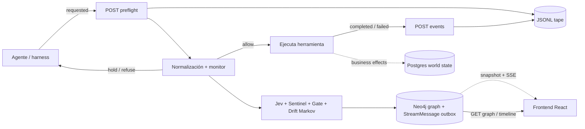

# Contrato v1 del monitor en tiempo real

Este documento permite implementar el frontend de visualización sin depender de detalles internos del backend. Distingue explícitamente lo que responde el código actual de la rama `full-architecture-v1` de lo que falta para completar el contrato realtime v1.

Convenciones:

- **IMPLEMENTADO**: existe hoy en FastAPI y se puede consumir.
- **OBJETIVO v1**: contrato estable que debe implementar el backend; todavía no existe.
- Fechas: ISO 8601 UTC.
- Niveles: `0 none`, `1 mild`, `2 moderate`, `3 severe`, `4 critical`, `5 catastrophic`.
- El identificador público de una ejecución es `run_id`; debe tratarse como una cadena opaca.

## 1. Arquitectura y responsabilidades



Cada almacén tiene una responsabilidad distinta:

| Almacén | Estado actual | Responsabilidad |
|---|---|---|
| JSONL tape | **IMPLEMENTADO** | Registro canónico append-only de cada `MonitorEvent` normalizado; recuperación, replay y contexto corto de Jev. Un fichero por `run_id`. |
| Neo4j | **IMPLEMENTADO** | Grafo persistente de runs, eventos, assessments, entidades y relaciones causales. Es la fuente del grafo visual. |
| Postgres world state | **OBJETIVO v1** | Estado de negocio sobre el que actúan las tools (reservas, memoria, trabajos). No almacena ni proyecta el grafo. La demo usa un world state mínimo en memoria. |
| Grafo Python en memoria | **IMPLEMENTADO, legado/transición** | Cadena clasificada usada por el pipeline actual para nivel, `short_term`/`long_term` y `node_id`. No debe ser fuente del frontend realtime. |

El frontend no debe leer Neo4j ni Postgres directamente. Toda lectura del grafo pasa por FastAPI. El tape no es una API de paginación para el navegador.

## 2. REST existente

Base local actual: `http://localhost:8000`. No hay autenticación.

### Estado de endpoints

| Método y path | Estado | Uso |
|---|---|---|
| `GET /health` | **IMPLEMENTADO** | Liveness: `{"status":"ok"}`. |
| `POST /api/runs/{run_id}/events` | **IMPLEMENTADO** | Ingiere una transición observada/completed/failed/refused. |
| `POST /api/runs/{run_id}/preflight` | **IMPLEMENTADO** | Evalúa una acción antes de ejecutarla; fuerza `phase="requested"`. |
| `GET /api/runs/` | **IMPLEMENTADO** | Lista runs encontrados en los tapes. |
| `GET /api/runs/{run_id}` | **IMPLEMENTADO** | Nivel y nodos clasificados con nivel ≥ 1 del grafo en memoria. |
| `GET /api/runs/{run_id}/timeline` | **IMPLEMENTADO** | Eventos y assessments persistidos en Neo4j. |
| `GET /api/runs/{run_id}/graph` | **IMPLEMENTADO** | Nodos y aristas salientes de eventos persistidos en Neo4j. |
| `GET /api/runs/{run_id}/snapshot` | **IMPLEMENTADO** | Snapshot del grafo Neo4j, último assessment y cursor del stream. |
| `GET /api/runs/{run_id}/stream` | **IMPLEMENTADO** | Stream SSE reanudable desde `after` o `Last-Event-ID`. |

### 2.1 Ingesta y preflight — IMPLEMENTADO

Ambos `POST` aceptan el mismo body. Solo `event` es obligatorio; Pydantic permite campos adicionales. Este ejemplo corresponde a preflight:

```json
{
  "event": "network_request",
  "event_id": "evt-01J8YQ8X2J",
  "session_id": "session-7",
  "sequence": 12,
  "timestamp": "2026-09-19T11:00:00Z",
  "kind": "network_request",
  "phase": "requested",
  "origin": "tool",
  "agent": "agent-demo",
  "tool": "http_request",
  "target": "https://example.invalid/upload",
  "channel": "api",
  "identity_state": "verified",
  "trust": "untrusted",
  "content": null,
  "args": {
    "method": "POST",
    "bytes_out": 412
  },
  "result": null,
  "effect": {
    "reversibility": "irreversible",
    "visible_to_user": false,
    "sensitivity": "credential",
    "scope": 1,
    "amount": null
  },
  "caused_by": ["evt-01J8YQ7ZAA"],
  "derived_from": ["evt-01J8YQ7ZAA"],
  "policy_version": "demo-agent:v1",
  "metadata": {
    "operation_id": "op-upload-9"
  }
}
```

Normalización actual relevante para el frontend:

- `event` se usa como `kind` si no llega `kind`.
- `event_id` o `id` se conserva. Si falta, el servicio genera `{run_id}:{sequence}`.
- `seq`/`ts` y `after` son aliases de `sequence`/`timestamp` y `caused_by`.
- Eventos de herramienta conocidos sin `phase` pasan a `completed`; el resto queda `observed`.
- `POST .../preflight` siempre sobrescribe `phase` a `requested`.
- Campos legacy que no estén reservados se guardan en `args`; el payload original también queda en `raw`.

Respuesta `200` completa actual:

```json
{
  "level": 4,
  "confidence": 0.91,
  "intent": "exfiltrate_secrets",
  "escalated": true,
  "degraded": false,
  "node_id": "demo:12",
  "event_id": "evt-01J8YQ8X2J",
  "decision": "refuse",
  "event_risk": 0.98,
  "trajectory_risk": 1.0,
  "reasons": ["P1_EXFILTRATION_PATH"],
  "graph_persisted": true,
  "dispatch_actions": [
    {
      "id": "contain_all_runs:demo",
      "run_id": "demo",
      "kind": "contain_all_runs",
      "state": "recorded",
      "counter_template": null,
      "source_event_id": "evt-01J8YQ8X2J",
      "created_at": "2026-09-19T11:00:00Z"
    },
    {
      "id": "cut_egress:demo",
      "run_id": "demo",
      "kind": "cut_egress",
      "state": "recorded",
      "counter_template": null,
      "source_event_id": "evt-01J8YQ8X2J",
      "created_at": "2026-09-19T11:00:00Z"
    },
    {
      "id": "page_oncall:demo",
      "run_id": "demo",
      "kind": "page_oncall",
      "state": "recorded",
      "counter_template": null,
      "source_event_id": "evt-01J8YQ8X2J",
      "created_at": "2026-09-19T11:00:00Z"
    }
  ],
  "jev_latency_ms": 84.317
}
```

Semántica:

- `decision`: `allow | hold | refuse`. Solo tiene efecto preventivo en preflight; `/events` registra lo ya ocurrido.
- `degraded=true`: Jev no produjo un veredicto. El evento sigue en JSONL y puede persistirse en Neo4j, pero `node_id` puede ser `null`.
- `graph_persisted=false`: Neo4j lanzó una excepción; la petición no falla porque el tape conserva el evento.
- Con Neo4j desactivado, la implementación actual devuelve `graph_persisted=true` aunque no escriba datos: significa “la llamada al store no falló”, no “el nodo existe”.
- `level` es el máximo entre nivel anterior, Jev y gate; nunca disminuye.

Errores actuales:

- `422` con el formato estándar de FastAPI si falta `event` o falla una validación.
- Otros fallos no capturados usan el error JSON estándar de FastAPI.
- No existe todavía `Idempotency-Key`: repetir un `POST` vuelve a añadir una línea al tape y vuelve a evaluar el monitor.

### 2.2 Lista y detalle de run — IMPLEMENTADO

`GET /api/runs/`:

```json
[
  {
    "run_id": "demo",
    "level": 4,
    "nodes": 3
  }
]
```

`nodes` cuenta solo key nodes (`level >= 1`), no todos los eventos. La lista de runs proviene de los nombres de los ficheros JSONL.

`GET /api/runs/demo`:

```json
{
  "run_id": "demo",
  "level": 4,
  "key_nodes": [
    {
      "id": "demo:12",
      "level": 4,
      "threshold": 0.91,
      "intent": "exfiltrate_secrets",
      "action_id": null
    }
  ]
}
```

Este detalle procede del **ActionGraph** en memoria (caché write-through), no del grafo Neo4j de visualización. Tras reiniciar el backend, `/api/graph/stream` puede arrancar vacío hasta que llegue ingest y rehidrate la caché desde Neo4j; snapshot/timeline Neo4j (`/api/runs/{run_id}/…`) siguen siendo la fuente v1 del monitor persistido.

### 2.3 Timeline Neo4j — IMPLEMENTADO

`GET /api/runs/demo/timeline` devuelve una lista ordenada por `event.sequence`, luego `event.timestamp`:

```json
[
  {
    "event": {
      "id": "evt-01J8YQ8X2J",
      "run_id": "demo",
      "sequence": 12,
      "timestamp": "2026-09-19T11:00:00+00:00",
      "kind": "network_request",
      "phase": "requested",
      "origin": "tool",
      "tool": "http_request",
      "target": "https://example.invalid/upload",
      "identity_state": "verified",
      "trust": "untrusted",
      "args_json": "{\"bytes_out\": 412, \"method\": \"POST\"}",
      "result_json": "{\"status\": 200}",
      "effect_json": "{\"reversibility\":\"irreversible\",\"visible_to_user\":false,\"sensitivity\":\"credential\",\"scope\":1,\"amount\":null}",
      "caused_by_json": "[\"evt-01J8YQ7ZAA\"]",
      "derived_from_json": "[\"evt-01J8YQ7ZAA\"]",
      "metadata_json": "{\"operation_id\": \"op-upload-9\"}",
      "raw_json": "{...}"
    },
    "assessment": {
      "id": "evt-01J8YQ8X2J:assessment",
      "drift_json": "{...}",
      "findings_json": "[...]",
      "gate_json": "{...}",
      "jev_answers_json": "{...}",
      "jev_model": "jev-1.13.0",
      "jev_latency_ms": 84.317,
      "dispatch_actions_json": "[...]"
    }
  }
]
```

Los objetos anidados están serializados como strings `*_json`; el frontend actual debe hacer `JSON.parse` defensivo. Si Neo4j está desactivado devuelve `[]`.

### 2.4 Graph Neo4j — IMPLEMENTADO

`GET /api/runs/demo/graph`:

```json
{
  "nodes": [
    {
      "id": "evt-01J8YQ8X2J",
      "labels": ["Event"],
      "properties": {
        "id": "evt-01J8YQ8X2J",
        "run_id": "demo",
        "sequence": 12,
        "kind": "network_request",
        "phase": "requested"
      }
    },
    {
      "id": "evt-01J8YQ8X2J:assessment",
      "labels": ["Assessment"],
      "properties": {
        "id": "evt-01J8YQ8X2J:assessment",
        "gate_json": "{...}"
      }
    }
  ],
  "edges": [
    {
      "source": "evt-01J8YQ8X2J",
      "target": "evt-01J8YQ8X2J:assessment",
      "type": "HAS_ASSESSMENT",
      "properties": {}
    }
  ]
}
```

El endpoint actual no devuelve el nodo `Run` ni su arista `HAS_EVENT`; consulta eventos del run y sus relaciones salientes. No hay cursor ni garantía de snapshot consistente con una lectura concurrente.

## 3. Modelo persistido en Neo4j

### Nodos

| Label | ID estable | Propiedades principales |
|---|---|---|
| `Run` | `run_id` | `id`, `created_at`, `updated_at`, `level` |
| `Event` | `MonitorEvent.id` | Campos escalares del evento; objetos/listas en `*_json`; un evento causal aún no recibido puede existir con `placeholder=true` |
| `Assessment` | `{event_id}:assessment` | `drift_json`, `findings_json`, `gate_json`, `jev_answers_json`, modelo/latencia y `dispatch_actions_json` |
| `Entity` | valor normalizado | `id`, `kind = agent | tool | target | channel`; herramientas usan `tool:{name}` y canales `channel:{name}` |

Hay constraints únicas sobre `Run.id`, `Event.id`, `Assessment.id` y `Entity.id`.

### Aristas dirigidas

| Tipo | Dirección | Significado |
|---|---|---|
| `HAS_EVENT` | `Run -> Event` | Pertenencia al run |
| `NEXT` | `Event anterior -> Event actual` | Secuencia, si existe exactamente `sequence - 1` |
| `HAS_ASSESSMENT` | `Event -> Assessment` | Resultado del monitor para esa transición |
| `TOUCHES {role}` | `Event -> Entity` | El evento toca agente, herramienta, target o canal |
| `CAUSED_BY` | `Event -> Event origen` | Dependencia causal declarada |
| `DERIVED_FROM` | `Event -> Event origen` | Procedencia de datos/contexto |

El ActionGraph histórico descrito en [Graph.md](Graph.md) es una estructura en memoria no dirigida. La visualización realtime v1 debe representar el modelo Neo4j dirigido anterior; no debe mezclar ambas semánticas.

## 4. Lifecycle de una operación

Una llamada de herramienta es una operación lógica con varias transiciones inmutables:

1. `requested`: el agente pide permiso mediante preflight.
2. Gate responde:
   - `allow`: la herramienta puede ejecutarse.
   - `hold`: no se ejecuta automáticamente; queda pendiente de una decisión externa.
   - `refuse`: no se ejecuta.
3. Si fue permitida, llega exactamente una transición terminal:
   - `completed`: terminó con resultado, incluso si el resultado de negocio es negativo.
   - `failed`: la herramienta no pudo completar; debe incluir error sanitizado.
4. Si no se ejecuta, el harness debe emitir `refused`, relacionado con el `requested`.

Contrato de correlación **IMPLEMENTADO en el harness de demo**:

- Cada transición tiene un `event_id` distinto e inmutable.
- Todas comparten `metadata.operation_id`.
- La transición terminal incluye el `event_id` de `requested` en `caused_by`.
- Nunca se muta un nodo `requested` para convertirlo en `completed`.
- `observed` se reserva para señales sin preflight, por ejemplo red o sistema.
- `hold` es una decisión del gate, no una fase. Si finalmente se cancela, se emite `refused`; si se aprueba y ejecuta, `completed` o `failed`.
- Las bandas pueden subir en `requested` para representar riesgo previsto, pero `amount_total` y `records_total` solo contabilizan efectos `completed`; `failed` y `refused` no materializan el efecto.

La implementación actual ya entiende las cinco fases, pero el harness genera IDs separados por ingesta y todavía no garantiza `operation_id` ni la transición `failed/refused` en todos los caminos. Además, el drift actual procesa todas las fases por igual y puede duplicar totales si el productor repite `scope`/`amount` en `requested` y en la transición terminal.

## 5. Snapshot inicial — IMPLEMENTADO

### Request

`GET /api/runs/{run_id}/snapshot`

Respuesta `200`:

```json
{
  "schema_version": 1,
  "generated_at": "2026-09-19T11:00:01Z",
  "cursor": "1042",
  "run": {
    "run_id": "demo",
    "level": 4,
    "decision": "refuse",
    "status": "active",
    "latest_sequence": 12,
    "latest_event_id": "evt-01J8YQ8X2J",
    "updated_at": "2026-09-19T11:00:00Z",
    "degraded": false,
    "graph_persisted": true
  },
  "graph": {
    "nodes": [
      {
        "id": "evt-01J8YQ8X2J",
        "labels": ["Event"],
        "properties": {
          "id": "evt-01J8YQ8X2J",
          "run_id": "demo",
          "sequence": 12,
          "kind": "network_request",
          "phase": "requested"
        }
      },
      {
        "id": "evt-01J8YQ8X2J:assessment",
        "labels": ["Assessment"],
        "properties": {
          "id": "evt-01J8YQ8X2J:assessment"
        }
      }
    ],
    "edges": [
      {
        "id": "HAS_ASSESSMENT:evt-01J8YQ8X2J:evt-01J8YQ8X2J:assessment",
        "source": "evt-01J8YQ8X2J",
        "target": "evt-01J8YQ8X2J:assessment",
        "type": "HAS_ASSESSMENT",
        "properties": {}
      }
    ]
  },
  "monitor": {
    "drift": {
      "data_exposure": 4,
      "tool_escalation": 0,
      "reversibility": 3,
      "authority_drift": 0,
      "context_integrity": 0,
      "blast_radius": 0,
      "amount_total": 0,
      "records_total": 1,
      "moved": ["data_exposure", "reversibility"],
      "markov_state": [4, 2],
      "p_violation": {
        "1": 1.0,
        "3": 1.0,
        "5": 1.0
      }
    },
    "latest_jev": {
      "event_id": "evt-01J8YQ8X2J",
      "assessment_id": "evt-01J8YQ8X2J:assessment",
      "level": 4,
      "confidence": 0.91,
      "probabilities": {
        "level_0_benign": 0.01,
        "level_1_mild": 0.01,
        "level_2_moderate": 0.02,
        "level_3_severe": 0.04,
        "level_4_critical": 0.91,
        "level_5_catastrophic": 0.01
      },
      "intent": "exfiltrate_secrets",
      "containment_breached": false,
      "degraded": false,
      "model": "jev-1.13.0",
      "latency_ms": 84.317
    },
    "findings": [
      {
        "id": "evt-01J8YQ8X2J:P1_EXFILTRATION_PATH",
        "event_id": "evt-01J8YQ8X2J",
        "rule_id": "P1_EXFILTRATION_PATH",
        "severity": 4,
        "evidence_event_ids": ["evt-01J8YQ7ZAA", "evt-01J8YQ8X2J"],
        "entities": ["agent-demo", "https://example.invalid/upload"],
        "cross_run": false,
        "detail": "Sensitive reads are followed by an external network request"
      }
    ],
    "latest_gate": {
      "event_id": "evt-01J8YQ8X2J",
      "gate": {
        "decision": "refuse",
        "incident_level": 4,
        "event_risk": 0.98,
        "trajectory_risk": 1.0,
        "reasons": ["P1_EXFILTRATION_PATH"]
      }
    }
  },
  "dispatch_actions": [
    {
      "id": "contain_all_runs:demo",
      "run_id": "demo",
      "kind": "contain_all_runs",
      "state": "recorded",
      "counter_template": null,
      "source_event_id": "evt-01J8YQ8X2J",
      "created_at": "2026-09-19T11:00:00Z"
    },
    {
      "id": "cut_egress:demo",
      "run_id": "demo",
      "kind": "cut_egress",
      "state": "recorded",
      "counter_template": null,
      "source_event_id": "evt-01J8YQ8X2J",
      "created_at": "2026-09-19T11:00:00Z"
    },
    {
      "id": "page_oncall:demo",
      "run_id": "demo",
      "kind": "page_oncall",
      "state": "recorded",
      "counter_template": null,
      "source_event_id": "evt-01J8YQ8X2J",
      "created_at": "2026-09-19T11:00:00Z"
    }
  ],
  "counters": []
}
```

Los arrays `graph.nodes` y `graph.edges` usan los tipos `GraphNode` y `GraphEdge` de la sección TypeScript. El backend debe capturar el high-water mark `cursor` y construir un estado que incluya exactamente eventos hasta ese cursor. Así, abrir el stream con `?after={cursor}` no deja huecos aunque haya escrituras entre snapshot y conexión SSE.

`404` significa run inexistente. Un run existente sin eventos puede devolver colecciones vacías y cursor vigente.

## 6. Protocolo SSE — IMPLEMENTADO

### Conexión

`GET /api/runs/{run_id}/stream?after={cursor}`

Headers de respuesta:

```http
Content-Type: text/event-stream
Cache-Control: no-cache, no-transform
Connection: keep-alive
X-Accel-Buffering: no
```

El stream emite:

```text
id: 1043
event: graph.node.upserted
data: {"schema_version":1,"stream_id":"1043","type":"graph.node.upserted","run_id":"demo","emitted_at":"2026-09-19T11:00:02Z","source_event_id":"evt-01J8YQ8X2J","data":{"node":{...}}}

```

Reglas:

- `id` SSE y `data.stream_id` son el mismo cursor opaco.
- El cursor es monotónico dentro del stream del run. El frontend no debe convertirlo a número ni inferir continuidad aritmética.
- `event` SSE coincide con `data.type`.
- `source_event_id` correlaciona todas las proyecciones producidas por un `MonitorEvent`.
- El backend emite primero nodos, luego aristas que los referencian y finalmente proyecciones/estado.
- Dentro de un evento fuente: `graph.*`, `drift.updated`, `jev.assessed`, cero o más `sentinel.finding`, `gate.decided`, `dispatch.action`/`counter.updated`, `run.updated`.
- Todo mensaje es un upsert o una transición con ID estable. Aplicarlo dos veces produce el mismo estado.

### Reconexión y retención

1. La primera conexión usa `?after=<snapshot.cursor>`.
2. En una reconexión automática, `EventSource` envía `Last-Event-ID`; el backend continúa estrictamente después de él.
3. Si llegan ambos, `Last-Event-ID` prevalece sobre `after`.
4. El frontend ignora cualquier mensaje cuyo `stream_id` ya haya aplicado.
5. Si el cursor es desconocido, inválido o quedó fuera de retención, el backend responde antes de abrir el stream con `409` y problem type `urn:hackspain:realtime:cursor-reset-required`. El cliente descarta su proyección, pide un snapshot nuevo y vuelve a conectar.

Heartbeat cada 15 segundos como comentario SSE, que no modifica estado ni cursor:

```text
: heartbeat 2026-09-19T11:00:15Z

```

El servidor puede enviar `retry: 3000`. Proxies deben desactivar buffering. La pérdida de conexión no implica que el run haya terminado.

### Envelope y payloads

Todos los mensajes comparten:

```ts
interface RealtimeEnvelope<TType extends RealtimeEventType, TData> {
  schema_version: 1;
  stream_id: string;
  type: TType;
  run_id: string;
  emitted_at: string;
  source_event_id: string | null;
  data: TData;
}
```

#### `graph.node.upserted`

```json
{
  "node": {
    "id": "evt-01J8YQ8X2J",
    "labels": ["Event"],
    "properties": {
      "id": "evt-01J8YQ8X2J",
      "run_id": "demo",
      "sequence": 12,
      "timestamp": "2026-09-19T11:00:00Z",
      "kind": "network_request",
      "phase": "requested",
      "origin": "tool",
      "tool": "http_request",
      "target": "https://example.invalid/upload"
    }
  }
}
```

#### `graph.edge.upserted`

```json
{
  "edge": {
    "id": "NEXT:evt-01J8YQ7ZAA:evt-01J8YQ8X2J",
    "source": "evt-01J8YQ7ZAA",
    "target": "evt-01J8YQ8X2J",
    "type": "NEXT",
    "properties": {}
  }
}
```

El ID objetivo de arista es determinista: `{type}:{source}:{target}` y, si hace falta distinguir roles, `:{role}`.

#### `drift.updated`

```json
{
  "event_id": "evt-01J8YQ8X2J",
  "drift": {
    "data_exposure": 4,
    "tool_escalation": 0,
    "reversibility": 3,
    "authority_drift": 0,
    "context_integrity": 0,
    "blast_radius": 0,
    "amount_total": 0,
    "records_total": 1,
    "moved": ["data_exposure", "reversibility"],
    "markov_state": [4, 2],
    "p_violation": {"1": 1.0, "3": 1.0, "5": 1.0}
  }
}
```

#### `jev.assessed`

```json
{
  "event_id": "evt-01J8YQ8X2J",
  "assessment_id": "evt-01J8YQ8X2J:assessment",
  "level": 4,
  "confidence": 0.91,
  "probabilities": {
    "level_0_benign": 0.01,
    "level_1_mild": 0.01,
    "level_2_moderate": 0.02,
    "level_3_severe": 0.04,
    "level_4_critical": 0.91,
    "level_5_catastrophic": 0.01
  },
  "intent": "exfiltrate_secrets",
  "containment_breached": false,
  "degraded": false,
  "model": "jev-1.13.0",
  "latency_ms": 84.317
}
```

#### `sentinel.finding`

```json
{
  "finding": {
    "id": "evt-01J8YQ8X2J:P1_EXFILTRATION_PATH",
    "event_id": "evt-01J8YQ8X2J",
    "rule_id": "P1_EXFILTRATION_PATH",
    "severity": 4,
    "evidence_event_ids": ["evt-01J8YQ7ZAA", "evt-01J8YQ8X2J"],
    "entities": ["agent-demo", "https://example.invalid/upload"],
    "cross_run": false,
    "detail": "Sensitive reads are followed by an external network request"
  }
}
```

#### `gate.decided`

```json
{
  "event_id": "evt-01J8YQ8X2J",
  "gate": {
    "decision": "refuse",
    "incident_level": 4,
    "event_risk": 0.98,
    "trajectory_risk": 1.0,
    "reasons": ["P1_EXFILTRATION_PATH"]
  }
}
```

#### `dispatch.action`

```json
{
  "action": {
    "id": "cut_egress:demo",
    "run_id": "demo",
    "kind": "cut_egress",
    "state": "recorded",
    "counter_template": null,
    "source_event_id": "evt-01J8YQ8X2J",
    "created_at": "2026-09-19T11:00:00Z"
  }
}
```

#### `counter.updated`

```json
{
  "counter": {
    "id": "counter:evt-01J8YQ7ZAA",
    "run_id": "demo",
    "kind": "counter_action",
    "state": "executed",
    "counter_template": "restore_file",
    "source_event_id": "evt-01J8YQ7ZAA",
    "created_at": "2026-09-19T10:59:58Z"
  }
}
```

Estados v1 del counter: `pending` después de `requested`, `armed` después de `completed`, `executed` cuando el incidente alcanza L3+, y `cancelled` si una operación no llega a ejecutarse. La implementación actual puede crear acciones `pending`, `armed` y `executed`, pero usa el ID de cada transición en vez de correlacionarlas por operación y aún no persiste ni publica esos cambios.

#### `run.updated`

```json
{
  "run": {
    "run_id": "demo",
    "level": 4,
    "decision": "refuse",
    "status": "active",
    "latest_sequence": 12,
    "latest_event_id": "evt-01J8YQ8X2J",
    "updated_at": "2026-09-19T11:00:00Z",
    "degraded": false,
    "graph_persisted": true
  }
}
```

### Errores SSE

Antes de abrir el stream se usan respuestas HTTP Problem Details:

```json
{
  "type": "urn:hackspain:realtime:cursor-reset-required",
  "title": "Realtime cursor is no longer available",
  "status": 409,
  "detail": "Fetch a new snapshot before reconnecting.",
  "run_id": "demo"
}
```

Después de abrirlo, un fallo recuperable cierra la conexión; el cliente reconecta con `Last-Event-ID`. Un fallo no recuperable puede emitir `event: stream.error` con `{code, message, retryable}` y cerrar. Ningún error SSE debe avanzar el cursor de estado.

## 7. Modelos TypeScript sugeridos

```ts
type Level = 0 | 1 | 2 | 3 | 4 | 5;
type EventPhase = "observed" | "requested" | "completed" | "failed" | "refused";
type ToolDecision = "allow" | "hold" | "refuse";
type JsonScalar = string | number | boolean | null;
type JsonValue = JsonScalar | JsonValue[] | { [key: string]: JsonValue };

interface GraphNode {
  id: string;
  labels: Array<"Run" | "Event" | "Assessment" | "Entity" | string>;
  properties: Record<string, JsonValue>;
}

interface GraphEdge {
  id: string;
  source: string;
  target: string;
  type:
    | "HAS_EVENT"
    | "NEXT"
    | "HAS_ASSESSMENT"
    | "TOUCHES"
    | "CAUSED_BY"
    | "DERIVED_FROM"
    | string;
  properties: Record<string, JsonValue>;
}

interface DriftState {
  data_exposure: number;
  tool_escalation: number;
  reversibility: number;
  authority_drift: number;
  context_integrity: number;
  blast_radius: number;
  amount_total: number;
  records_total: number;
  moved: string[];
  markov_state: [maximumBand: number, elevatedBands: number];
  p_violation: Record<"1" | "3" | "5", number>;
}

interface SentinelFinding {
  id: string;
  event_id: string;
  rule_id: string;
  severity: Level;
  evidence_event_ids: string[];
  entities: string[];
  cross_run: boolean;
  detail: string;
}

interface GateDecision {
  decision: ToolDecision;
  incident_level: Level;
  event_risk: number;
  trajectory_risk: number;
  reasons: string[];
}

interface DispatchAction {
  id: string;
  run_id: string;
  kind: string;
  state: "recorded" | "pending" | "armed" | "executed" | "cancelled" | string;
  counter_template: string | null;
  source_event_id: string | null;
  created_at: string;
}

interface RunProjection {
  run_id: string;
  level: Level;
  decision: ToolDecision;
  status: "active" | "completed" | "failed" | string;
  latest_sequence: number | null;
  latest_event_id: string | null;
  updated_at: string;
  degraded: boolean;
  graph_persisted: boolean;
}

interface JevAssessment {
  event_id: string;
  assessment_id: string;
  level: Level;
  confidence: number;
  probabilities: Record<string, number>;
  intent: string | null;
  containment_breached: boolean;
  degraded: boolean;
  model: string | null;
  latency_ms: number | null;
}

interface MonitorSnapshot {
  schema_version: 1;
  generated_at: string;
  cursor: string;
  run: RunProjection;
  graph: { nodes: GraphNode[]; edges: GraphEdge[] };
  monitor: {
    drift: DriftState;
    latest_jev: JevAssessment | null;
    findings: SentinelFinding[];
    latest_gate: { event_id: string; gate: GateDecision } | null;
  };
  dispatch_actions: DispatchAction[];
  counters: DispatchAction[];
}

type RealtimeEventType =
  | "graph.node.upserted"
  | "graph.edge.upserted"
  | "drift.updated"
  | "jev.assessed"
  | "sentinel.finding"
  | "gate.decided"
  | "dispatch.action"
  | "counter.updated"
  | "run.updated";
```

## 8. Hook React de snapshot + SSE

El ejemplo usa IDs para upserts y conserva el cursor como string. `EventSource` reenvía automáticamente `Last-Event-ID` cuando el navegador reconecta la misma instancia.

```tsx
import { useEffect, useReducer } from "react";

type State = MonitorSnapshot & {
  connection: "connecting" | "open" | "closed";
  seen_stream_ids: Set<string>;
};
type Message = RealtimeEnvelope<RealtimeEventType, Record<string, unknown>>;
type Action =
  | { type: "snapshot"; snapshot: MonitorSnapshot }
  | { type: "message"; message: Message }
  | { type: "connection"; connection: State["connection"] };

const upsert = <T extends { id: string }>(items: T[], item: T): T[] => {
  const index = items.findIndex((current) => current.id === item.id);
  if (index < 0) return [...items, item];
  const next = items.slice();
  next[index] = item;
  return next;
};

function reducer(state: State | null, action: Action): State | null {
  if (action.type === "snapshot") {
    return {
      ...action.snapshot,
      connection: "connecting",
      seen_stream_ids: new Set([action.snapshot.cursor]),
    };
  }
  if (!state) return state;
  if (action.type === "connection") {
    return { ...state, connection: action.connection };
  }

  const { message } = action;
  // Duplicados de reconexión son no-op.
  if (state.seen_stream_ids.has(message.stream_id)) return state;
  const seen_stream_ids = new Set(state.seen_stream_ids).add(message.stream_id);
  const next = { ...state, cursor: message.stream_id, seen_stream_ids };

  switch (message.type) {
    case "graph.node.upserted":
      next.graph = {
        ...state.graph,
        nodes: upsert(state.graph.nodes, message.data.node as GraphNode),
      };
      break;
    case "graph.edge.upserted":
      next.graph = {
        ...state.graph,
        edges: upsert(state.graph.edges, message.data.edge as GraphEdge),
      };
      break;
    case "drift.updated":
      next.monitor = { ...state.monitor, drift: message.data.drift as DriftState };
      break;
    case "jev.assessed":
      next.monitor = { ...state.monitor, latest_jev: message.data as unknown as JevAssessment };
      break;
    case "sentinel.finding":
      next.monitor = {
        ...state.monitor,
        findings: upsert(
          state.monitor.findings,
          message.data.finding as SentinelFinding,
        ),
      };
      break;
    case "gate.decided":
      next.monitor = {
        ...state.monitor,
        latest_gate: message.data as unknown as State["monitor"]["latest_gate"],
      };
      break;
    case "dispatch.action":
      next.dispatch_actions = upsert(
        state.dispatch_actions,
        message.data.action as DispatchAction,
      );
      break;
    case "counter.updated":
      next.counters = upsert(state.counters, message.data.counter as DispatchAction);
      break;
    case "run.updated":
      next.run = message.data.run as RunProjection;
      break;
  }
  return next;
}

export function useRealtimeMonitor(
  runId: string,
  apiBase = "http://localhost:8000",
) {
  const [state, dispatch] = useReducer(reducer, null);

  useEffect(() => {
    const abort = new AbortController();
    let events: EventSource | undefined;

    async function start() {
      const response = await fetch(
        `${apiBase}/api/runs/${encodeURIComponent(runId)}/snapshot`,
        { signal: abort.signal, credentials: "include" },
      );
      if (!response.ok) throw new Error(`snapshot failed: ${response.status}`);
      const snapshot = (await response.json()) as MonitorSnapshot;
      dispatch({ type: "snapshot", snapshot });

      events = new EventSource(
        `${apiBase}/api/runs/${encodeURIComponent(runId)}/stream?after=${encodeURIComponent(snapshot.cursor)}`,
        { withCredentials: true },
      );
      events.onopen = () => dispatch({ type: "connection", connection: "open" });
      events.onerror = () => dispatch({ type: "connection", connection: "connecting" });

      const names: RealtimeEventType[] = [
        "graph.node.upserted",
        "graph.edge.upserted",
        "drift.updated",
        "jev.assessed",
        "sentinel.finding",
        "gate.decided",
        "dispatch.action",
        "counter.updated",
        "run.updated",
      ];
      names.forEach((name) => {
        events?.addEventListener(name, (event) => {
          const message = JSON.parse((event as MessageEvent<string>).data) as Message;
          dispatch({ type: "message", message });
        });
      });
    }

    start().catch((error) => {
      if (!abort.signal.aborted) {
        console.error(error);
        dispatch({ type: "connection", connection: "closed" });
      }
    });
    return () => {
      abort.abort();
      events?.close();
    };
  }, [apiBase, runId]);

  return state;
}
```

El conjunto de cursores aplicados debe acotarse a la ventana de retención para no crecer indefinidamente. Para recuperar un `409` por retención, recrear el ciclo completo snapshot + stream.

## 9. Ordering, idempotencia y persistencia realtime en Neo4j

El backend materializa el grafo y su stream exclusivamente en Neo4j:

- `(:Run)-[:HAS_EVENT]->(:Event)` conserva el historial completo.
- `(:Event)-[:HAS_ASSESSMENT]->(:Assessment)` conserva drift, Jev, Sentinel, gate y acciones.
- `(:Run)-[:HAS_STREAM_MESSAGE]->(:StreamMessage)` es el outbox ordenado y reanudable de SSE.
- Constraints únicas sobre IDs hacen idempotentes los upserts del grafo.
- JSONL aporta deduplicación por `event_id` antes de reevaluar y sigue siendo la fuente de replay forense.

Reglas:

- Para una ingesta nueva, JSONL se añade antes de depender de Jev/Neo4j para no perder evidencia.
- Neo4j usa `MERGE` por IDs estables.
- Cada ingesta persiste en Neo4j los `StreamMessage` antes de publicarlos al broker SSE; tras restart se reanudan consultando esos nodos.
- Si Neo4j falla, el broker puede avisar a clientes conectados, pero el evento queda marcado `graph_persisted=false` y debe reconciliarse desde JSONL.
- Repetir el mismo `(run_id, event_id)` con body idéntico devuelve la respuesta previa sin reevaluar. Un body diferente devuelve `409 urn:hackspain:ingest:idempotency-conflict`.
- `Idempotency-Key` será opcional para compatibilidad, recomendado en productores y único por run.

El cursor ordena cambios de proyección, no sustituye a `Event.sequence`. Dos transiciones con timestamps iguales se ordenan por cursor. `sequence` debe asignarse de forma atómica por run en v1; el cálculo actual `count(JSONL)+1` no es seguro ante ingestas concurrentes.

## 10. Cadena, drift y estado Markov: ejemplo end-to-end

Supóngase este run:

1. `evt-1`, `file_read`, `requested`, sensibilidad `credential`: se crea `Event(evt-1)`, su assessment y entidades `tool:read_file`/target. Gate permite. Drift eleva `data_exposure` a 3.
2. `evt-2`, `file_read`, `completed`, `caused_by=["evt-1"]`: se crean `CAUSED_BY evt-2 -> evt-1` y `NEXT evt-1 -> evt-2`; el counter no aplica porque leer es reversible.
3. `evt-3`, `network_request`, `requested`, target externo, irreversible y con sensibilidad `credential`, derivado de `evt-2`: Sentinel encuentra `P1_EXFILTRATION_PATH`; se crean `DERIVED_FROM evt-3 -> evt-2` y entidades. Drift sube `data_exposure=4` y `reversibility=3`; gate rechaza y el run escala a L4.
4. `evt-4`, `network_request`, `refused`, `caused_by=["evt-3"]`: queda visible que el efecto no ocurrió. Dispatch registra `contain_all_runs`, `cut_egress` y `page_oncall`.

En cada paso el vector de bandas es:

```text
[data_exposure, tool_escalation, reversibility,
 authority_drift, context_integrity, blast_radius]
```

El estado Markov compacto es `[maximum, elevated]`, donde `maximum` es la banda mayor y `elevated` cuenta bandas ≥ 2. Para `[4,0,3,0,0,0]` resulta `[4,2]`. Con `maximum >= 4`, `p_violation` es `1.0` en horizontes 1, 3 y 5. En bandas menores, el backend calcula primero:

```text
p1 = min(0.95, 0.02 + 0.12 * maximum + 0.07 * elevated)
p(h) = 1 - (1 - p1)^h, para h ∈ {1,3,5}
```

Las bandas actuales solo suben durante la vida del proceso y los totales acumulan `scope`/`amount`. El snapshot restaura la última evaluación persistida en Neo4j; el frontend solo la representa, nunca la recalcula.

## 11. Webhooks, autenticación y redacción

### SSE frente a webhooks

SSE es el canal backend → browser: unidireccional, ordenado, reanudable y adecuado para una pestaña abierta. Un webhook es backend → backend: entrega cambios a integraciones externas, con firma, reintentos y deduplicación. No se debe pedir al navegador que exponga un webhook ni usar webhooks para dibujar el grafo en vivo.

Si se añaden webhooks, pueden reutilizar los envelopes del outbox, pero necesitan contrato separado: HTTPS, firma HMAC con timestamp, delivery ID, backoff, política de expiración y respuesta `2xx`. Su cursor/delivery no sustituye `Last-Event-ID`.

### Autenticación futura

Hoy todos los endpoints están abiertos. Objetivo v1:

- Autorizar tanto snapshot como stream por pertenencia al run/tenant.
- Preferir cookie `HttpOnly`, `Secure`, `SameSite` compatible con `EventSource`; nunca poner bearer tokens en query strings.
- Si se exige header `Authorization`, usar `fetch` streaming y parser SSE porque `EventSource` nativo no permite headers arbitrarios.
- Validar `Origin`, conservar CORS con allowlist explícita y no compartir cursores entre tenants.
- `401` indica sesión ausente/expirada; `403`, run no autorizado; ninguno debe revelar si existe un run de otro tenant.

### Redacción

La implementación actual persiste `content`, `args`, `result` y `raw` sin una capa general de redacción. Por tanto, el frontend no debe mostrar `raw_json` ni secretos y el sistema no debe exponerse a datos reales hasta implementar redacción.

Objetivo v1: redactar antes de JSONL, Neo4j, world state y SSE, usando la misma política versionada. Como mínimo:

- claves `authorization`, `cookie`, `set-cookie`, `api_key`, `token`, `password`, `secret`;
- credenciales en URLs y query strings;
- contenido de ficheros sensibles y outputs largos;
- PII configurada por tenant.

Conservar forma y metadatos útiles (`bytes`, hash, tipo, target sanitizado), sustituir valores por `"[REDACTED]"` y registrar `metadata.redaction = {policy_version, fields}`. La respuesta REST y SSE nunca puede ser menos redactada que los almacenes. Los detalles de findings también pasan por la política.

## 12. Criterios de aceptación backend/frontend

El contrato realtime v1 está completo cuando:

1. Snapshot y SSE existen y una escritura concurrente entre ambos no se pierde.
2. Cortar y restaurar la conexión continúa desde `Last-Event-ID` sin duplicar nodos/aristas.
3. Un cursor expirado fuerza snapshot nuevo.
4. Repetir una ingesta con el mismo `event_id` no duplica tape, Neo4j, dispatch ni SSE.
5. El frontend reconstruye igual estado con snapshot solo que con snapshot + replay del outbox.
6. Reiniciar FastAPI no borra drift, counters, run state ni cursor.
7. El grafo diferencia claramente `requested`, terminal y `refused`.
8. Los tres almacenes y SSE reciben datos ya redactados.
